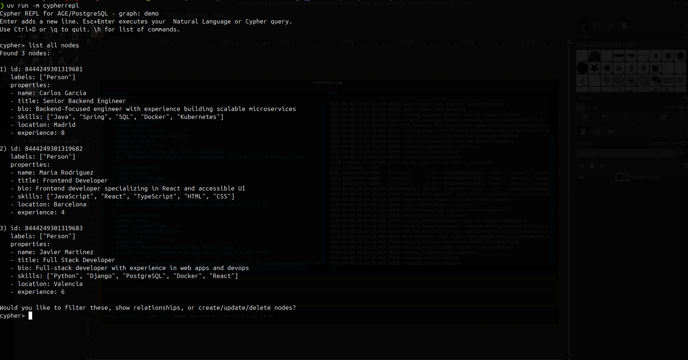
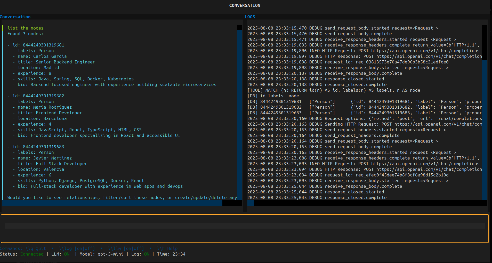

# TriStore Cypher LLM REPL


Natural‑language & Cypher exploration of a PostgreSQL "TriStore" (Relational + Graph + Vectors) powered by Apache AGE and pgvector.

> **NOTE**: The current implementation concentrates on interactive exploration of the graph / vector store layer (PostgreSQL + Apache AGE via Cypher). Planned extensions include integrated embedding generation and additional "noSQL" style document / key-value context features to evolve this into a broader multi‑modal context engineering tool.

**Components in this repo**

| Part | What it is | Folder / File |
|------|------------|---------------|
| Interactive REPL (LLM + direct Cypher) - 2 versions | Query graph with natural language or raw Cypher | `cypher_llm_repl.py`, `cypherrepl/` |
| Detailed REPL manual | Full feature & usage guide | `REPL-MANUAL.md` |
| Cypher cheat sheet & how‑to | Quick Cypher reminders | `Cypher Cheat Sheet and How-To Guide.md` |
| Dockerized Postgres 16 + AGE + pgvector | Single container tri-store | `Dockerfile`, `init-tristore.sql` |
| Sample graph init | Optional starting graph | `init_graph.cypher` |


---


## FEATURES

- Interactive Cypher REPL for PostgreSQL/AGE
- Execute Cypher scripts from files
- LLM integration for query generation and explanation
- System prompt customization for LLM
- Verbose error output for debugging
- **Colourful Text User Interface (TUI):** Use the `-t` or `--tui` option to launch a modern, colourful Text User Interface for enhanced interaction.

*Simple (default) REPL*


*TUI REPL (using the Textual library)*


---

## Startup Options

The Cypher REPL can be started with various options to customize its behavior:

```
positional arguments:
  files                 Cypher files to load and execute

options:
  -h, --help            show this help message and exit
  -e, --execute         Execute files and exit (do not start REPL)
  -t, --tui             Launch the Textual TUI instead of the standard REPL (shows a colourful Text User Interface)
  -s, --system-prompt SYSTEM_PROMPT
                        Path to a file containing a system prompt for the LLM
  -v, --verbose         Enable verbose output (show stack traces on errors)
```

---

## 1. REPL Overview (Primary Focus)

The Cypher LLM REPL lets you:

* Use plain English (LLM mode) → translated into Cypher and executed
* Fall back to direct Cypher mode instantly (`\llm off` / `\llm on`)
* Run multiple Cypher statements in one line (semicolon separated)
* Auto-detect return columns & format nodes, edges, and paths
* Persist command history between sessions
* Optionally log: natural language → generated Cypher → DB results

See the full manual in `REPL-MANUAL.md` for screenshots, examples, tips.

### 1.1 Key Commands (inline recap)
| Command |  Description |
|---------|-------------|
| `\q` | Quit the REPL |
| `\log [on \| off]` | Toggle logging of LLM and DB interactions |
| `\llm [on \|off]` | Toggle LLM usage (off executes Cypher directly) |
| `\h` | Show this help message |

### 1.2 Quick Examples
Natural language (LLM mode):
```
show all nodes and their relationships
create a person named Alice who is 30
find shortest path between Alice and any Button
```

Direct Cypher:
```
MATCH (n) RETURN n;
MATCH (n)-[r]->(m) RETURN n, r, m;
CREATE (p:Person {name: 'Alice', age: 30}) RETURN p;
```

### 1.3 Environment Variables (REPL)
Put these in a `.env` (see `example.env`):
```
PGHOST=localhost
PGPORT=5432
PGDATABASE=postgres
PGUSER=postgres
PGPASSWORD=secret
AGE_GRAPH=demo

# LLM (optional – only needed for natural language mode)
OPENAI_API_KEY=your_api_key_here
OPENAI_MODEL_NAME=gpt-4.1
OPENAI_TEMPERATURE=0
```

### 1.4 Running the REPL
Install Python deps (uses `pyproject.toml`). You can use [uv](https://github.com/astral-sh/uv) or plain pip:
```bash
# With uv (fast)
uv sync

# Start REPL (LLM mode default)
python cypher_llm_repl.py

or the refactored version

python -m cypherrepl

# Execute files then drop into REPL
python -m cypherrepl init_graph.cypher

# Execute files only (no REPL)
python -m cypherrepl -e init_graph.cypher more.cypher
```

For advanced usage, read: `REPL-MANUAL.md`  
For Cypher syntax help: `Cypher Cheat Sheet and How-To Guide.md`

---

## 2. Dockerized TriStore (Postgres + AGE + pgvector)

The provided `Dockerfile` builds a single image bundling:
* PostgreSQL 16
* Apache AGE (openCypher property graph)
* pgvector (vector similarity search)

Initialization script: `init-tristore.sql` (creates extensions + a default graph `my_graph`).

### 2.1 Build & Run
```bash
docker build -t tristore-pg:latest .
docker run -d \
  --name tristore \
  -e POSTGRES_PASSWORD=secret \
  -p 5432:5432 \
  tristore-pg:latest
```

Defaults:
* Host: `localhost:5432`
* User: `postgres`
* Password: `secret`
* DB: `postgres`
* Graph created at init: `my_graph`

### 2.2 Verify Extensions
```bash
psql -h localhost -U postgres -d postgres
\dx   # should list age + vector
```

### 2.3 Simple Graph & Vector Checks
Create a node:
```sql
SELECT * FROM cypher('my_graph', $$CREATE (n:Person {name: 'Alice', age: 30}) RETURN n$$) AS (n agtype);
```
Vector table:
```sql
CREATE TABLE embeddings (
  id serial PRIMARY KEY,
  content text,
  embedding vector(1536)
);
```
Similarity search:
```sql
SELECT * FROM embeddings ORDER BY embedding <-> '[0.1,0.2,0.3]' LIMIT 1;
```

### 2.4 Using with the REPL
Once the container is running, ensure your `.env` matches the exposed credentials, then start the REPL. Natural language queries will be rewritten into Cypher targeting the configured graph.

---

## 3. Python Access (Outside the REPL)
```python
import psycopg2

conn = psycopg2.connect(
    host="localhost", port=5432,
    user="postgres", password="secret", dbname="postgres"
)
cur = conn.cursor()

# Raw Cypher via AGE
q = "MATCH (p:Person) RETURN p"
cur.execute("SELECT * FROM cypher(%s, %s) AS (p agtype);", ("my_graph", q))
print(cur.fetchall())

# Vector similarity
cur.execute(
    "SELECT content FROM embeddings ORDER BY embedding <-> %s LIMIT 1",
    ([0.12, 0.04, 0.33],)
)
print(cur.fetchone())
```

---

## 4. Project Structure (Abbrev.)
```
cypherrepl/       # REPL implementation (CLI, db, LLM integration, formatting)
cypher_llm_repl.py# Entry script
Dockerfile        # Builds Postgres+AGE+pgvector image
init-tristore.sql # Enables extensions & creates graph
init_graph.cypher # Sample Cypher to preload data
example.env       # Template env vars
REPL-MANUAL.md    # Full REPL manual
Cypher Cheat Sheet and How-To Guide.md
```

---

## 5. Roadmap / Ideas
* Optional local embedding generation
* More graph analytics helpers (degree, centrality summaries)
* Export/import graph snapshots
* Additional model provider abstractions

Contributions / issues welcome.

---

## 6. License

MIT License. See `LICENSE.txt` for full text.

Copyright (c) 2025, Iwan van der Kleijn

---

## 7. Attribution & Notes
All bundled components (PostgreSQL, Apache AGE, pgvector) are open source. This repo glues them together for a smooth graph + vector + LLM exploration workflow.

If you build something interesting with this, let me know or open a PR to showcase examples.
If you build something interesting with this, let me know or open a PR to showcase examples.
